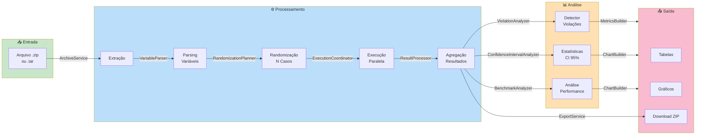
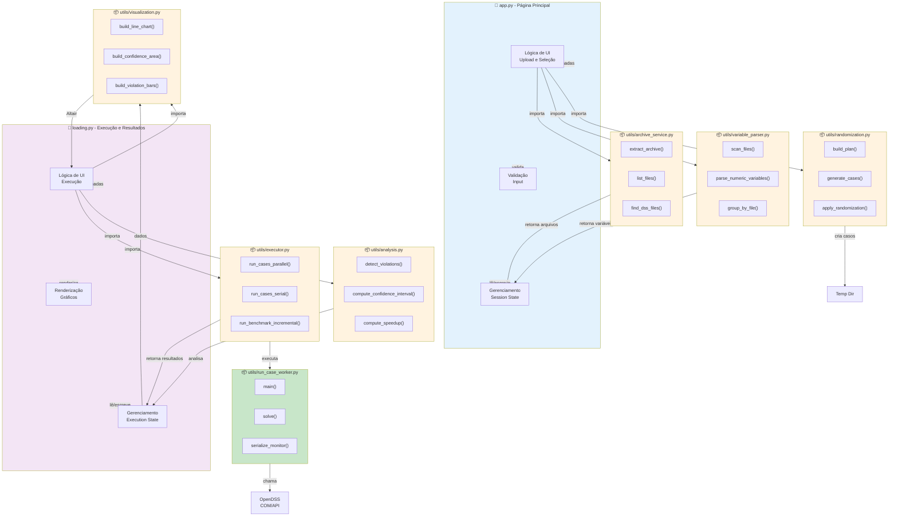
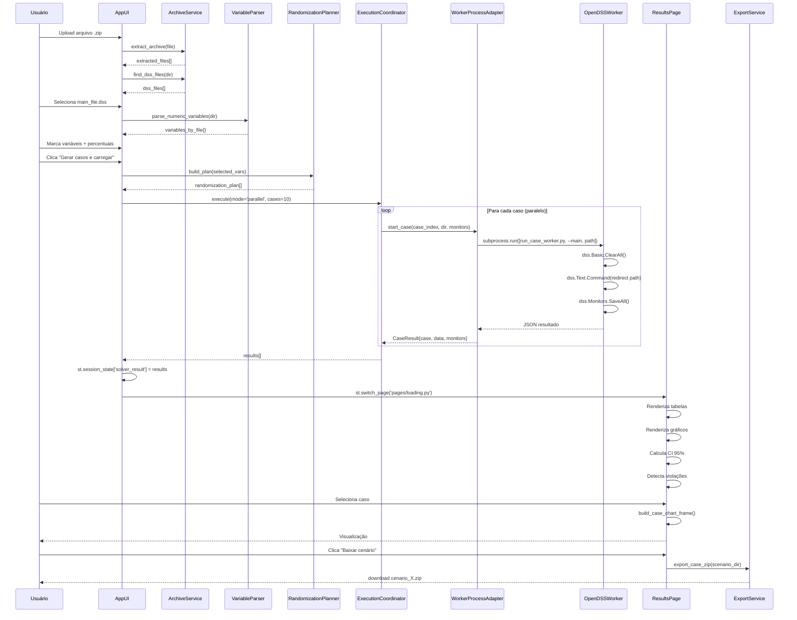

# 🏗️ Arquitetura de Software - OpenDSS MultiThread

## Diagrama de Arquitetura em Camadas

```mermaid
graph TB
    subgraph UI["📱 Camada de Apresentação"]
        AppUI["AppUI<br/>(app.py)"]
        ResultsPage["ResultsPage<br/>(loading.py)"]
        SessionState["SessionStateManager<br/>(st.session_state)"]
    end

    subgraph Services["🔧 Camada de Serviços"]
        Archive["ArchiveService"]
        VarParser["VariableParser"]
        Validator["InputValidator"]
        RandomPlan["RandomizationPlanner"]
        ScenGen["ScenarioGenerator"]
        Monitor["MonitorConfigService"]
        Executor["ExecutionCoordinator"]
        WorkerAdapter["WorkerProcessAdapter"]
        
        ResultProc["ResultProcessor"]
        ViolAnalyzer["ViolationAnalyzer"]
        CIAnalyzer["ConfidenceIntervalAnalyzer"]
        BenchAnalyzer["BenchmarkAnalyzer"]
        
        ChartBuilder["ChartBuilder"]
        MetricsBuilder["MetricsBuilder"]
        ExportService["ExportService"]
        
        TempMgr["TempFileManager"]
        Logger["LoggingService"]
    end

    subgraph Domain["📦 Camada de Domínio"]
        VarSpec["VariableSpec"]
        RandRule["RandomizationRule"]
        MonitorLimit["MonitorLimit"]
        SimCase["SimulationCase"]
        CaseResult["CaseResult"]
        MonitorDataset["MonitorDataset"]
    end

    subgraph External["🔗 Camada Externa"]
        OpenDSSWorker["OpenDSSWorker<br/>(run_case_worker.py)"]
        OpenDSSLib["OpenDSS COM/API"]
        TempFS["Temp FileSystem"]
    end

    %% UI → Services
    AppUI -->|upload_file| Archive
    AppUI -->|extract_dir| Archive
    AppUI -->|find_main_file| Archive
    AppUI -->|parse_vars| VarParser
    Archive -->|validate_archive| Validator
    
    VarParser -->|validate_vars| Validator
    VarParser -->|produce| VarSpec
    
    AppUI -->|build_plan| RandomPlan
    RandomPlan -->|consume| VarSpec
    RandomPlan -->|produce| RandRule
    
    AppUI -->|generate_cases| ScenGen
    ScenGen -->|consume| RandRule
    ScenGen -->|create_temp_dir| TempMgr
    ScenGen -->|produce| SimCase
    
    AppUI -->|load_monitors| Monitor
    Monitor -->|validate_config| Validator
    Monitor -->|produce| MonitorLimit
    
    AppUI -->|execute| Executor
    Executor -->|orchestrate| WorkerAdapter
    Executor -->|log_event| Logger
    
    %% Services → Domain
    RandomPlan -->|create| RandRule
    Archive -->|create| VarSpec
    Monitor -->|create| MonitorLimit
    Executor -->|create| SimCase
    
    %% Worker Adapter → External
    WorkerAdapter -->|start_subprocess| OpenDSSWorker
    WorkerAdapter -->|capture_json| OpenDSSWorker
    WorkerAdapter -->|handle_error| Logger
    
    OpenDSSWorker -->|execute| OpenDSSLib
    OpenDSSWorker -->|read_files| TempFS
    
    %% Results Processing
    Executor -->|return_result| ResultProc
    ResultProc -->|produce| CaseResult
    ResultProc -->|parse_json| MonitorDataset
    
    CaseResult -->|analyze| ViolAnalyzer
    CaseResult -->|analyze| CIAnalyzer
    CaseResult -->|analyze| BenchAnalyzer
    
    %% Visualization
    ResultProc -->|build_chart| ChartBuilder
    ViolAnalyzer -->|build_metrics| MetricsBuilder
    CIAnalyzer -->|build_chart| ChartBuilder
    BenchAnalyzer -->|build_chart| ChartBuilder
    
    %% Results Page
    ResultsPage -->|query_results| SessionState
    ResultsPage -->|render| ChartBuilder
    ResultsPage -->|render| MetricsBuilder
    ResultsPage -->|export| ExportService
    
    ExportService -->|consume| SimCase
    ExportService -->|consume| CaseResult
    ExportService -->|zip_files| TempFS
    
    %% Cleanup
    TempMgr -->|manage_dirs| TempFS
    Logger -->|file_io| TempFS
    
    style UI fill:#e1f5ff
    style Services fill:#fff3e0
    style Domain fill:#f3e5f5
    style External fill:#e8f5e9
```

## Diagrama de Fluxo de Dados

## Diagrama de Componentes por Módulo

## Diagrama de Sequência - Fluxo Completo

## Diagrama de Dependências de Classe

```mermaid
graph TB
    AppUI["<b>AppUI</b><br/>+ render_home()<br/>+ handle_upload()<br/>+ handle_randomization()"]
    
    SessionState["<b>SessionStateManager</b><br/>+ get key<br/>+ set key<br/>+ initialize()"]
    
    Archive["<b>ArchiveService</b><br/>+ extract_archive<br/>+ list_files<br/>+ find_dss_files"]
    
    Parser["<b>VariableParser</b><br/>+ scan_files<br/>+ parse_numeric_variables<br/>+ group_by_file"]
    
    Validator["<b>InputValidator</b><br/>+ validate_archive<br/>+ validate_dss<br/>+ validate_config"]
    
    RandomPlan["<b>RandomizationPlanner</b><br/>+ build_plan<br/>+ validate_plan"]
    
    ScenGen["<b>ScenarioGenerator</b><br/>+ generate_cases<br/>+ clone_structure<br/>+ apply_randomization"]
    
    Monitor["<b>MonitorConfigService</b><br/>+ load_available<br/>+ validate_limits"]
    
    Executor["<b>ExecutionCoordinator</b><br/>+ execute<br/>+ run_parallel<br/>+ run_serial<br/>+ run_incremental"]
    
    WorkerAdapter["<b>WorkerProcessAdapter</b><br/>+ start_case<br/>+ read_result<br/>+ handle_error"]
    
    ResultProc["<b>ResultProcessor</b><br/>+ to_dataframes<br/>+ normalize_data<br/>+ to_tidy_format"]
    
    ViolAnalyzer["<b>ViolationAnalyzer</b><br/>+ detect_violations<br/>+ count_by_case<br/>+ frequency_dist"]
    
    CIAnalyzer["<b>ConfidenceIntervalAnalyzer</b><br/>+ compute_mean<br/>+ compute_ci95"]
    
    BenchAnalyzer["<b>BenchmarkAnalyzer</b><br/>+ compare_times<br/>+ compute_speedup"]
    
    ChartBuilder["<b>ChartBuilder</b><br/>+ line_chart<br/>+ area_chart<br/>+ bar_chart"]
    
    MetricsBuilder["<b>MetricsBuilder</b><br/>+ violation_metrics<br/>+ benchmark_metrics"]
    
    TempMgr["<b>TempFileManager</b><br/>+ create_dir<br/>+ cleanup_dir<br/>+ cleanup_on_exit"]
    
    Logger["<b>LoggingService</b><br/>+ info<br/>+ warning<br/>+ error<br/>+ track_run"]
    
    VarSpec["VarSpec"]
    RandRule["RandRule"]
    MonitorLimit["MonitorLimit"]
    SimCase["SimCase"]
    CaseResult["CaseResult"]
    
    AppUI --> SessionState
    AppUI --> Archive
    AppUI --> Parser
    AppUI --> Validator
    AppUI --> RandomPlan
    AppUI --> ScenGen
    AppUI --> Monitor
    AppUI --> Executor
    AppUI --> Logger
    
    Archive --> Validator
    Archive --> VarSpec
    
    Parser --> VarSpec
    Parser --> Validator
    
    RandomPlan --> RandRule
    RandomPlan --> Validator
    
    ScenGen --> RandRule
    ScenGen --> SimCase
    ScenGen --> TempMgr
    
    Monitor --> MonitorLimit
    Monitor --> Validator
    
    Executor --> WorkerAdapter
    Executor --> SimCase
    Executor --> Logger
    
    WorkerAdapter --> CaseResult
    
    ResultProc --> CaseResult
    
    ViolAnalyzer --> CaseResult
    ViolAnalyzer --> MonitorLimit
    
    CIAnalyzer --> CaseResult
    BenchAnalyzer --> CaseResult
    
    ChartBuilder --> CaseResult
    MetricsBuilder --> CaseResult
    
    ExportService["<b>ExportService</b><br/>+ export_zip"] --> SimCase
    ExportService --> CaseResult
    ExportService --> TempMgr
    
    ResultsPage["<b>ResultsPage</b>"] --> SessionState
    ResultsPage --> ResultProc
    ResultsPage --> ViolAnalyzer
    ResultsPage --> CIAnalyzer
    ResultsPage --> BenchAnalyzer
    ResultsPage --> ChartBuilder
    ResultsPage --> MetricsBuilder
    ResultsPage --> ExportService
    
    style AppUI fill:#bbdefb
    style SessionState fill:#bbdefb
    style Archive fill:#ffe0b2
    style Parser fill:#ffe0b2
    style Validator fill:#ffe0b2
    style RandomPlan fill:#ffe0b2
    style ScenGen fill:#ffe0b2
    style Monitor fill:#ffe0b2
    style Executor fill:#ffe0b2
    style WorkerAdapter fill:#ffe0b2
    style ResultProc fill:#ffe0b2
    style ViolAnalyzer fill:#ffe0b2
    style CIAnalyzer fill:#ffe0b2
    style BenchAnalyzer fill:#ffe0b2
    style ChartBuilder fill:#ffe0b2
    style MetricsBuilder fill:#ffe0b2
    style TempMgr fill:#ffe0b2
    style Logger fill:#ffe0b2
    style ResultsPage fill:#bbdefb
    style ExportService fill:#ffe0b2
    style VarSpec fill:#f3e5f5
    style RandRule fill:#f3e5f5
    style MonitorLimit fill:#f3e5f5
    style SimCase fill:#f3e5f5
    style CaseResult fill:#f3e5f5
```

## Padrões de Design Utilizados

| Padrão | Componente | Propósito |
|--------|-----------|----------|
| **Service Layer** | ArchiveService, VariableParser, Executor | Encapsular lógica de negócio |
| **Adapter** | WorkerProcessAdapter | Abstrair comunicação com subprocesso |
| **Factory** | ScenarioGenerator | Criar instâncias de casos |
| **Coordinator** | ExecutionCoordinator | Orquestrar múltiplos serviços |
| **State** | SessionStateManager | Gerenciar estado da aplicação |
| **Validator** | InputValidator | Validar input em um único lugar |
| **Builder** | ChartBuilder, MetricsBuilder | Construir visualizações complexas |
| **Strategy** | run_parallel, run_serial, run_incremental | Diferentes estratégias de execução |

---

**Versão:** 1.0  
**Data:** 2026-06-11  
**Status:** Pronto para DrawIO
