# 📐 Diagramas - OpenDSS MultiThread

## 1. Arquitetura Geral (Simplificada)

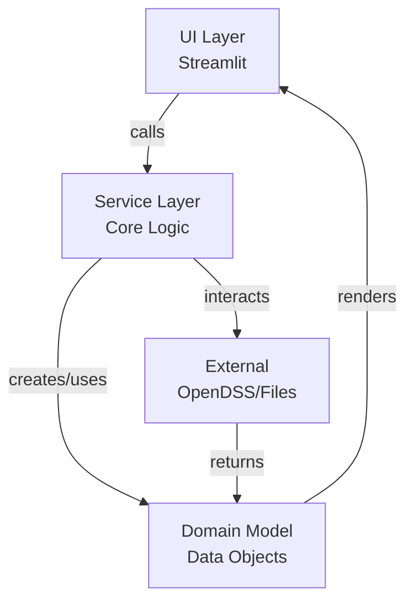

## 2. Pipeline de Processamento

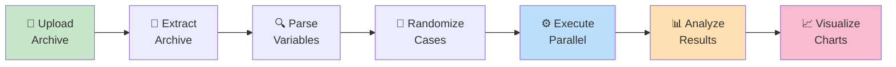

## 3. Estrutura de Diretórios

```
OpenDSSMultiThread/
│
├── src/
│   ├── app.py                      # Página principal (upload + config)
│   ├── pages/
│   │   └── loading.py              # Página de execução e resultados
│   ├── utils/
│   │   ├── __init__.py
│   │   ├── run_case_worker.py      # Subprocesso isolado (OpenDSS)
│   │   ├── archive_service.py      # Extração e manipulação de arquivos
│   │   ├── variable_parser.py      # Parsing de variáveis numéricas
│   │   ├── randomization.py        # Geração de casos randomizados
│   │   ├── executor.py             # Orquestração de execução (serial/paralelo)
│   │   ├── analysis.py             # Análises (violações, CI, benchmark)
│   │   └── visualization.py        # Construção de gráficos
│   └── requirements.txt
│
├── data/
│   └── examples/                   # Datasets de exemplo
│
├── tests/
│   └── test_*.py                   # Testes automatizados
│
├── .github/
│   └── workflows/                  # CI/CD (GitHub Actions)
│
├── ESPECIFICACAO.md                # Requisitos funcionais/não-funcionais
├── ARQUITETURA.md                  # Diagramas de arquitetura detalhados
├── DIAGRAMAS.md                    # Este arquivo (diagramas rápidos)
└── README.md                       # Documentação geral
```

## 4. Estado da Aplicação (Session State)

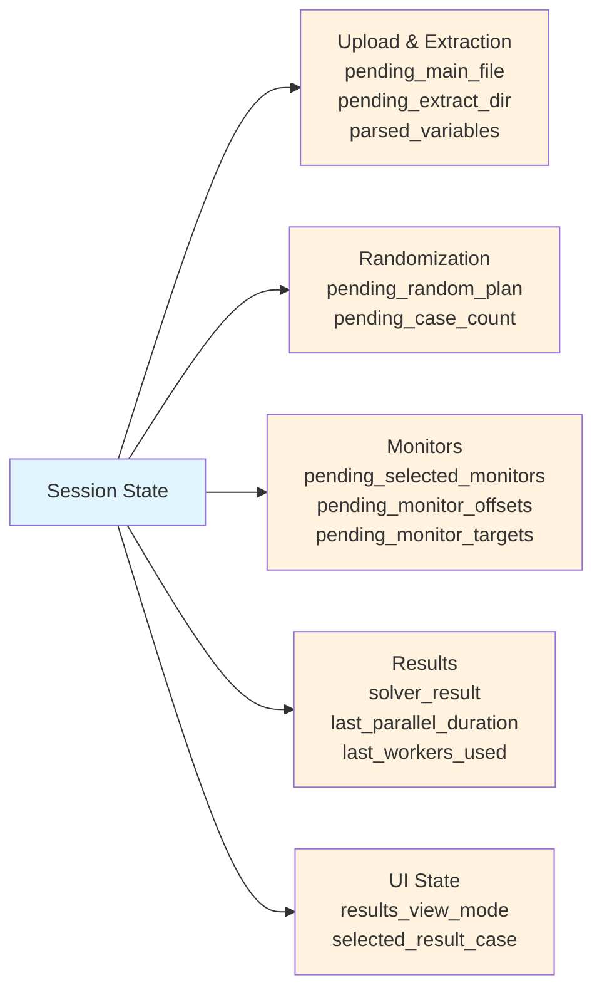

## 5. Fluxo do Usuário

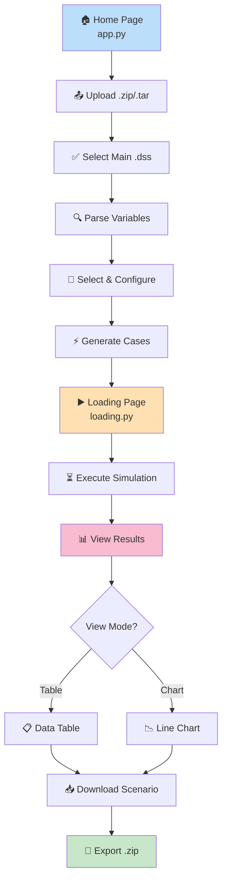

## 6. Ciclo de Vida de um Caso

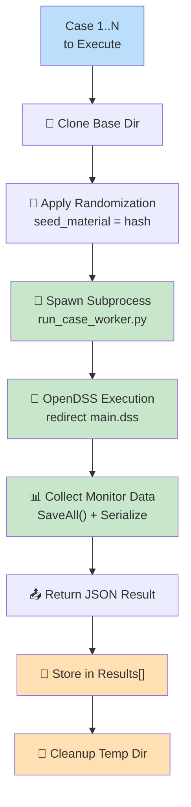

## 7. Execução Serial vs. Paralela vs. Incremental

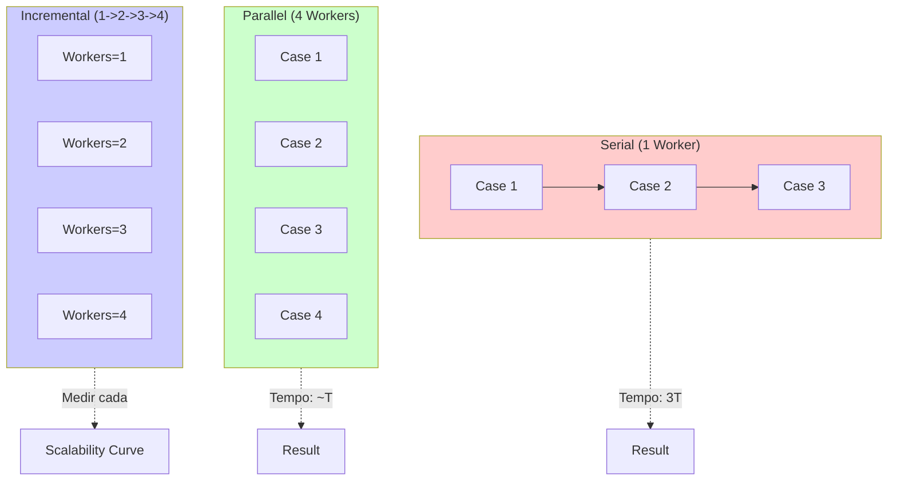

## 8. Análise de Violações

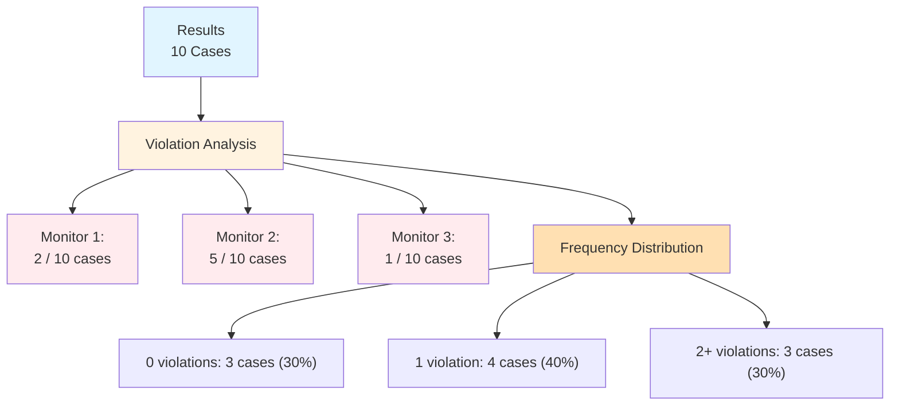

## 9. Intervalo de Confiança (CI 95%)

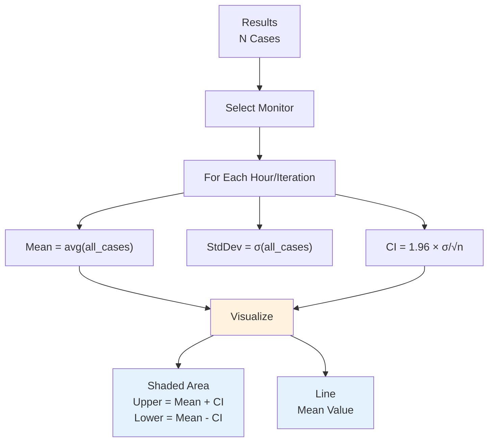

## 10. Estrutura de Dados - CaseResult

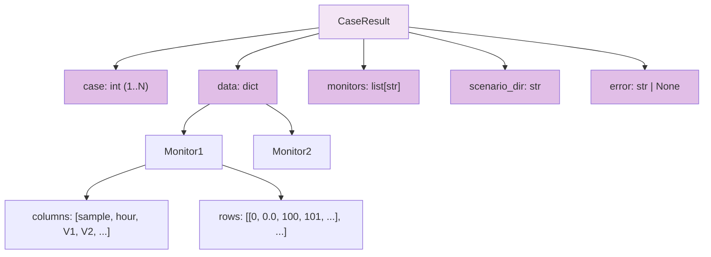

## 11. Interações Usuário × Sistema (Activity Diagram)

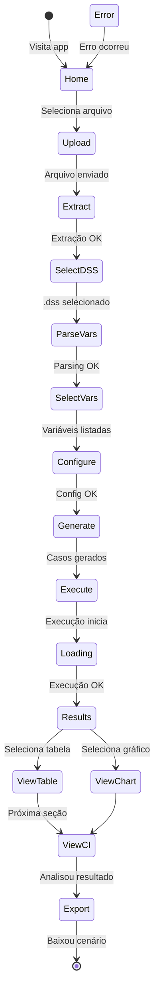

## 12. Benchmarking - Curva de Escalabilidade

```
Workers (X) vs. Tempo (Y)

Tempo (s)
    ^
 90 |     ╱╲
 80 |    ╱  ╲___
 70 |   ╱       ╲
 60 |  ╱         ╲___
 50 | ╱              ╲__
 40 |╱                  
    +──────────────────────→ Workers
    1  2  3  4  5  6  7  8

Ideal (linear): tempo ↓ com mais workers
Real: plateau quando I/O ≥ CPU
```

## 13. Pipeline de Tratamento de Erros

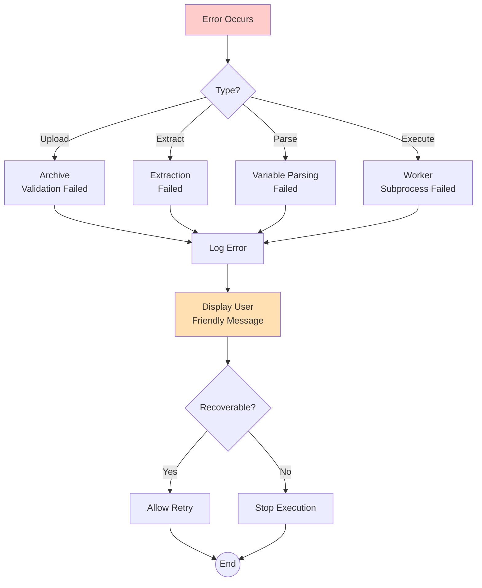

## 14. Modelo de Dados - Variável Numérica

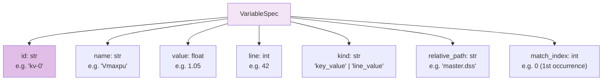

## 15. Integração OpenDSS

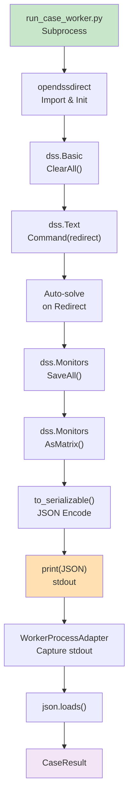

---

**Versão:** 1.0  
**Data:** 2026-06-06  
**Status:** Referência Inicial   para Desenvolvimento
